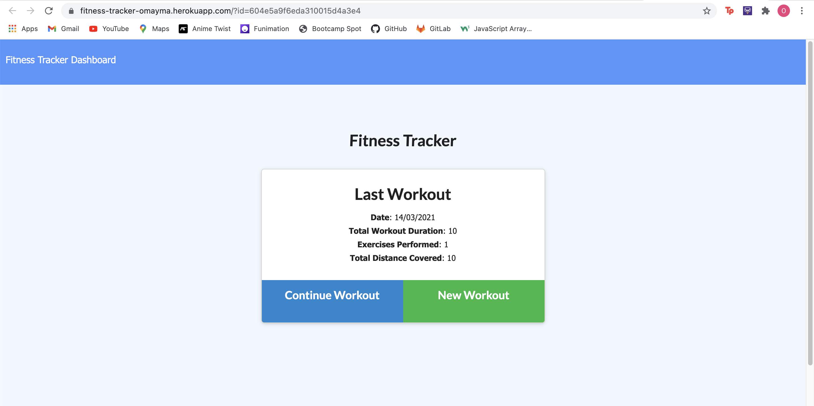

# Workout Tracker

### What it does:

* Workout Tracker is a fitness application that lets users view and track daily workouts. 

* Users are able to log multiple exercises in a workout on a given day. 

* They are also able to track the name, type, weight, reps, and duration of exercise. For cardio based exercise the distance traveled can be logged. 

* All workouts are stored in a database. 

This assignment will require you to create Mongo database with a Mongoose schema and handle routes with Express.

## Technology Used

* Express

* MongoDB / Atlas

* Mongoose

* Node.js 

* package.JSON

* gitignore

* Javascript

## Links

* [GitHub repository](https://github.com/omaymaahmad/week-17-workout-tracker) 

* [Heroku Deployed Link](https://fitness-tracker-omayma.herokuapp.com) 

* [My GitHub](https://github.com/omaymaahmad)  

* My Email: <omayma.ahmad25@gmail.com>

## Screenshot of Application

